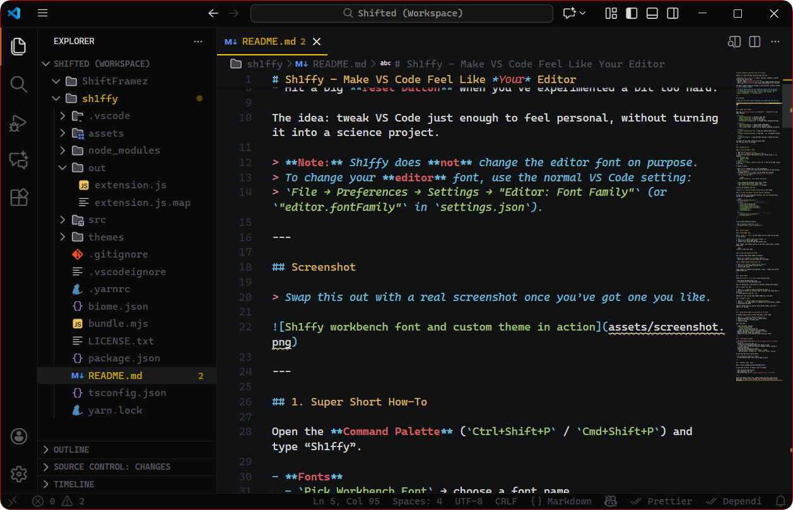

# Sh1ffy – Workbench Font & Private Theme Loader for VS Code

Sh1ffy is a lightweight VS Code extension that lets you:

- Use a **custom font** for the **workbench UI** (tabs, side bar, panels, settings, etc.).
- Import your own **private color themes** from local JSON / JSONC files, without publishing them anywhere.

> **Important:** Sh1ffy **does not change the editor text font** used for code.  
> Your editor font is still configured via the standard VS Code setting: `editor.fontFamily`.

---

## 1. Workbench Font – How to Use

1. Open the **Command Palette**:  
   `Ctrl + Shift + P` (Windows/Linux) or `Cmd + Shift + P` (macOS).
2. Run: **`[ Sh1ffy ] → Workbench Font Actions`**.
3. Choose **“Set WorkBench Font”** and enter a font family that is **installed on your machine**, for example:
   - `JetBrains Mono`
   - `Cascadia Code`
   - `Fira Code`
   - `Inter`
4. Then choose **“Enable WorkBench Font”** and confirm **Reload Window** when prompted.

From now on, the **VS Code UI (workbench)** will use your custom font, but the **code editor** will still use whatever you set in `editor.fontFamily`.

> The font name must match a font that is **installed locally** on your computer. If the font isn’t installed, VS Code will fall back to defaults.

### Before Uninstalling Sh1ffy

Before you uninstall the extension:

1. Open the Command Palette.
2. Run **`[ Sh1ffy ] → Workbench Font Actions`**.
3. Select **“Disable WorkBench Font”**.  
   This removes Sh1ffy’s custom UI font tweaks and avoids leftover styling.

---

## 2. Importing Your Own Color Themes

You can load your own themes directly from `.json` or `.jsonc` files on your computer.

1. Open the **Command Palette**.
2. Run: **`[ Sh1ffy ] → Color Theme Actions`**.
3. Choose **“Import Theme(s)”**.
4. Select one or more **JSON / JSONC theme files**.
5. After import:
   - The themes will appear in the **Color Theme** picker.
   - Their names will start with `sh1ffy •`, for easy recognition.
6. Open the Color Theme picker:
   - Command Palette → **“Preferences: Color Theme”**  
   - or via Settings UI.
7. **Select your imported theme** (e.g. `sh1ffy • My Custom Theme`) from the list.

That’s it – your private theme is now usable without being published to any marketplace or website.

---

## 3. Repairing If Something Goes Wrong

If you ever feel that themes or fonts are out of sync, or something looks off:

1. Open the **Command Palette**.
2. Run: **`[ Sh1ffy ] → Color Theme Actions`**.
3. Choose **“Repair Theme Contributions”**.  
   This will rescan imported themes and try to fix Sh1ffy’s changes.
4. When prompted, click **“Reload Window”** to apply the repair.

You can also use **“Restore package.json Backup”** from the same menu if you want to revert Sh1ffy’s theme-related changes back to their original state.

---

## 4. VS Code Warnings & Prompts

Because Sh1ffy tweaks parts of VS Code’s UI, you may occasionally see:

- **“Your Code installation appears to be corrupt”**  
  - This is expected after Sh1ffy changes some UI assets.  
  - You can safely **ignore this warning** or set it to **“Never show again”**.

- **“Extensions have been modified on disk, please reload”**  
  - Click **“Reload”** when you see this.  
  - This is how VS Code asks to apply the latest Sh1ffy changes.

These prompts are normal when modifying the UI and are not a sign of malicious behavior.

---

## 5. Summary

- Sh1ffy gives you a **custom workbench UI font** and **private theme loader** for VS Code.
- It **does not** change the editor text font; use `editor.fontFamily` for that.
- Imported themes are **local and private**, appear under **Color Themes** with a `sh1ffy •` prefix, and must be **chosen manually** from the Color Theme picker after import.
- You can **repair** or **restore** if anything looks wrong, and you should **disable the custom font before uninstalling** the extension.

Enjoy personalizing your VS Code look and feel without publishing anything publicly.